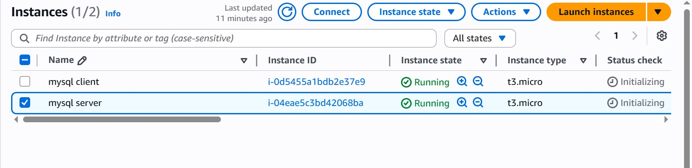
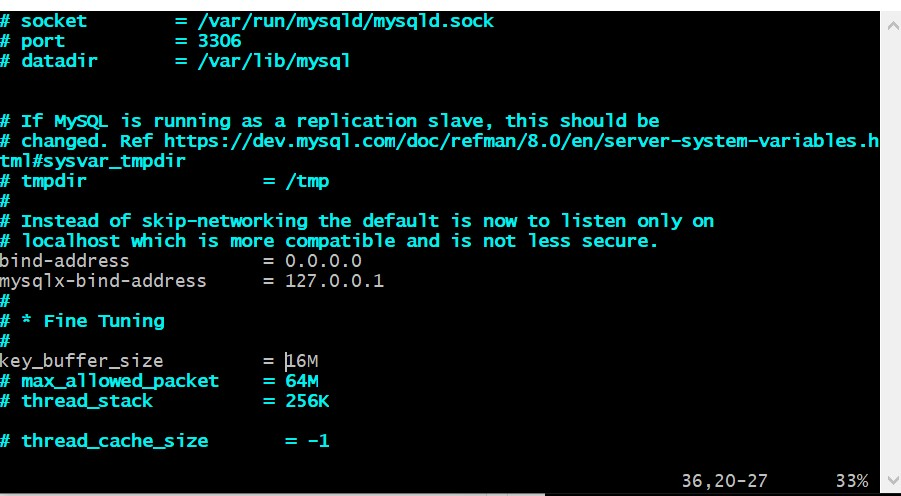
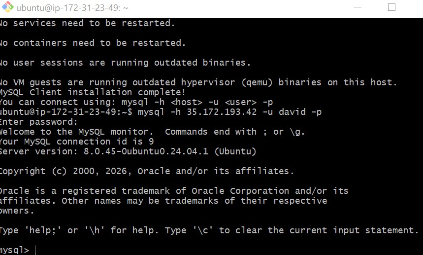
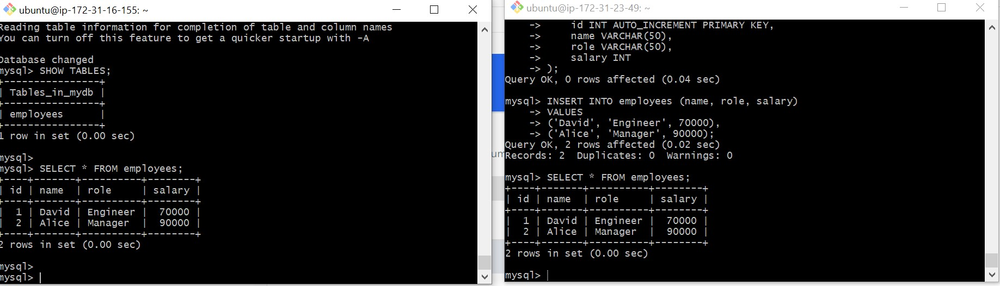

# MySQL Client-Server Architecture on AWS EC2

A demonstration of a basic client-server architecture using MySQL RDBMS, deployed across two Linux-based EC2 instances on AWS. One instance acts as the **MySQL Server** and the other as the **MySQL Client**, communicating over a local private network without SSH.

---

## Table of Contents

1. [Project Overview](#project-overview)
2. [Architecture & Design Choices](#architecture--design-choices)
3. [Prerequisites](#prerequisites)
4. [Step 1 – Launch Two EC2 Instances](#step-1--launch-two-ec2-instances)
5. [Step 2 – Install MySQL Server on Server A](#step-2--install-mysql-server-on-server-a)
6. [Step 3 – Install MySQL Client on Server B](#step-3--install-mysql-client-on-server-b)
7. [Step 4 – Configure Security Group for Port 3306](#step-4--configure-security-group-for-port-3306)
8. [Step 5 – Configure MySQL Server to Allow Remote Connections](#step-5--configure-mysql-server-to-allow-remote-connections)
9. [Step 6 – Create a Remote MySQL User](#step-6--create-a-remote-mysql-user)
10. [Step 7 – Connect Remotely from MySQL Client](#step-7--connect-remotely-from-mysql-client)

---

## Project Overview

This project implements a **client-server architecture** using MySQL as the database engine, deployed across two separate EC2 instances in the same AWS Virtual Private Cloud (VPC).

| Instance | Name | Role | Software |
|----------|------|------|---------|
| Server A | `mysql server` | Hosts and serves the database | MySQL Server |
| Server B | `mysql client` | Connects to and queries the database | MySQL Client |

**Key constraint:** The MySQL Client connects to the MySQL Server using only the **private/local IP address** — no SSH tunnelling. This demonstrates true client-server communication at the network level.

> **Fun fact:** MySQL's name is a combination of "My" — the name of co-founder Michael Widenius's daughter — and "SQL", the abbreviation for Structured Query Language.

---

## Architecture & Design Choices

### How the Two Servers Communicate

```
┌──────────────────────────────┐        ┌──────────────────────────────┐
│      Server B                │        │      Server A                │
│    (mysql client)            │        │    (mysql server)            │
│                              │        │                              │
│  MySQL Client utility        │──────▶ │  MySQL Server (Port 3306)    │
│                              │  TCP   │                              │
│  Private IP: 172.31.x.x      │        │  Private IP: 172.31.x.x      │
└──────────────────────────────┘        └──────────────────────────────┘
         Both instances in the same AWS VPC / local network
```

### Why Use Private IP Instead of Public IP?

Both EC2 instances are launched in the same AWS VPC, meaning they share a local virtual network and can reach each other via **private IP addresses** without going through the public internet. Using the private IP is:

- **Faster** — traffic stays within the AWS network and never leaves
- **More secure** — the database port is not exposed to the public internet
- **Cost-effective** — internal AWS traffic between instances in the same region is free

### Why Restrict Port 3306 to the Client's IP Only?

Rather than opening port 3306 to `0.0.0.0/0` (all IPs), the inbound rule is scoped to only the **private IP address of the MySQL client**. This follows the principle of least privilege — only the machine that needs database access can reach it, significantly reducing the attack surface.

---

## Prerequisites

- An AWS account with permission to launch EC2 instances
- Two SSH key pairs (or one shared key) for accessing both instances
- Basic familiarity with the Linux terminal and MySQL

---

## Step 1 – Launch Two EC2 Instances

Launch **two separate EC2 instances** in the same AWS region and VPC. Both should use the same base configuration:

| Setting | Value |
|---------|-------|
| AMI | Ubuntu Server 22.04 LTS |
| Instance Type | `t2.micro` (free tier eligible) |
| VPC | Default VPC (same for both) |
| Subnet | Same availability zone (recommended) |
| Key Pair | Your existing `.pem` key pair |
| Storage | 8 GB gp2 (default) |

Name them clearly in the AWS console:

- **Instance 1:** `mysql server`
- **Instance 2:** `mysql client`

#### 📸 Screenshot  – AWS Console: Both EC2 Instances Running
> _Should show the EC2 Instances dashboard with both `mysql server` and `mysql client` instances listed side by side, each with a green **"Running"** status. Both private IP addresses should be visible in the instance details._



---

### Note the Private IP Address of `mysql server`

Before proceeding, record the **private IPv4 address** of the `mysql server` instance. This will be needed in later steps when configuring the security group and connecting from the client.

```
Example private IP: 172.31.16.xxx
---

## Step 2 – Install MySQL Server on Server A

SSH into the `mysql server` instance and install the MySQL Server software.

```bash
# SSH into mysql server
ssh -i "your-key.pem" ubuntu@<mysql-server-public-ip>
```

```bash
# Update the package index
sudo apt update

# Install MySQL Server
sudo apt install mysql-server -y
---

### Start and Enable MySQL Service

```bash
# Start the MySQL service
sudo systemctl start mysql

# Enable MySQL to start on reboot
sudo systemctl enable mysql

# Verify MySQL is running
sudo systemctl status mysql
```

## Step 3 – Install MySQL Client on Server B

Open a **new terminal window** and SSH into the `mysql client` instance. Install only the MySQL Client package — the full server is not needed here.

```bash
# SSH into mysql client (in a new terminal)
ssh -i "your-key.pem" ubuntu@<mysql-client-public-ip>
```

```bash
# Update the package index
sudo apt update

# Install MySQL Client only
sudo apt install mysql-client -y
```

> **Note:** `mysql-client` installs only the `mysql` command-line utility — the lightweight tool needed to connect to a remote MySQL server. Installing the full `mysql-server` package on this instance is unnecessary and wastes resources.


## Step 4 – Configure Security Group for Port 3306

By default, MySQL listens on **TCP port 3306**. The `mysql server` Security Group must be updated to allow inbound traffic on this port — but only from the private IP of the `mysql client`.

### Steps in the AWS Console

1. Navigate to **EC2 → Instances** and click on the `mysql server` instance
2. Click the **Security** tab, then click the linked Security Group
3. Click **Edit inbound rules → Add rule**
4. Configure the new rule as follows:

| Field | Value |
|-------|-------|
| Type | MySQL/Aurora |
| Protocol | TCP |
| Port Range | 3306 |
| Source | Custom — enter the **private IP** of `mysql client` with `/32` (e.g., `172.31.20.xxx/32`) |
| Description | Allow MySQL client access |

5. Click **Save rules**

> Using `/32` means only that exact IP address is allowed — no other machine can reach port 3306 on the server, even within the VPC.

## Step 5 – Configure MySQL Server to Allow Remote Connections

By default, MySQL is configured to only accept connections from `localhost` (`127.0.0.1`). The `bind-address` setting in the MySQL configuration file must be updated to allow connections from other hosts.

### Edit the MySQL Configuration File

Back on the **`mysql server`** terminal:

```bash
sudo vi /etc/mysql/mysql.conf.d/mysqld.cnf
```

Find the line:

```ini
bind-address = 127.0.0.1
```

Change it to:

```ini
bind-address = 0.0.0.0
```

> **What this does:** Setting `bind-address` to `0.0.0.0` instructs MySQL to listen for connections on all available network interfaces — not just the local loopback. Combined with the Security Group restriction from Step 4, MySQL is reachable from the network but access is still controlled at the firewall level.

Save and exit:
- In `vi`: press `Esc`, type `:wq`, then press `Enter`

#### 📸 Screenshot  – Terminal: `mysqld.cnf` File Showing `bind-address = 0.0.0.0`
> _Should show the `mysqld.cnf` file open in `vi` on the `mysql server`, with the `bind-address` line clearly changed from `127.0.0.1` to `0.0.0.0`._



---

### Restart MySQL to Apply the Change

```bash
sudo systemctl restart mysql

# Confirm MySQL restarted successfully
sudo systemctl status mysql
```


## Step 6 – Create a Remote MySQL User

MySQL requires a dedicated user account that is permitted to connect from a remote host. The default `root` user is restricted to `localhost` and cannot be used for remote connections.

On the **`mysql server`** terminal, log into MySQL:

```bash
sudo mysql
```

Run the following SQL commands to create a remote user and grant privileges:

```sql
-- Create a user that can connect from the mysql client's private IP
CREATE USER 'remote_user'@'172.31.20.xxx' IDENTIFIED BY 'StrongPassword123!';

-- Grant full privileges on all databases (adjust as needed for production)
GRANT ALL PRIVILEGES ON *.* TO 'remote_user'@'172.31.20.xxx' WITH GRANT OPTION;

-- Apply the privilege changes immediately
FLUSH PRIVILEGES;

-- Confirm the user was created
SELECT user, host FROM mysql.user;

-- Exit the MySQL shell
EXIT;
```

> Replace `172.31.20.xxx` with the actual private IP of your `mysql client` instance, and choose a strong password.


## Step 7 – Connect Remotely from MySQL Client

Now switch to the **`mysql client`** terminal and connect to the remote MySQL server using only the private IP address — no SSH required.

```bash
# Connect to mysql server from mysql client using the private IP
mysql -u remote_user -p -h 172.31.16.xxx
```

| Flag | Meaning |
|------|---------|
| `-u remote_user` | The MySQL username created in Step 6 |
| `-p` | Prompt for the password |
| `-h 172.31.16.xxx` | The **private IP** of the `mysql server` instance |

Enter the password when prompted.

#### 📸 Screenshot  – Terminal: Successful Remote MySQL Connection from Client
> _Should show the `mysql client` terminal after a successful remote login, displaying the **MySQL welcome banner** with the server version and the `mysql>` prompt — confirming the client connected to the remote server without SSH._



---

### Verify the Connection with SQL Queries

Once connected, run the following to confirm the connection is fully functional:

```sql
-- Show all databases on the remote server
SHOW DATABASES;
```
### Optional — Practice Queries

With the remote connection working, practice the following operations to further explore the setup:

```sql
-- Create a new database
CREATE DATABASE testdb;

-- Switch to it
USE testdb;

-- Create a table
CREATE TABLE users (
  id   INT AUTO_INCREMENT PRIMARY KEY,
  name VARCHAR(100),
  email VARCHAR(100)
);

-- Insert a record
INSERT INTO users (name, email) VALUES ('Ada Lovelace', 'ada@example.com');

-- Select all records
SELECT * FROM users;

-- Drop the table when done
DROP TABLE users;

-- Drop the database when done
DROP DATABASE testdb;
```

#### 📸 Screenshot  – Terminal: Practice SQL Queries Running on Remote Server
> _Should show one or more of the optional SQL commands above being run from the `mysql client` terminal — such as `CREATE DATABASE`, `INSERT`, or `SELECT * FROM users` — with results returned from the `mysql server`, further demonstrating the live client-server connection._



---

